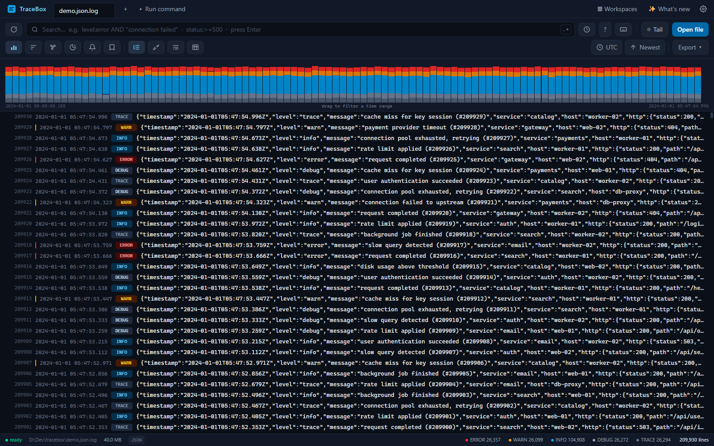
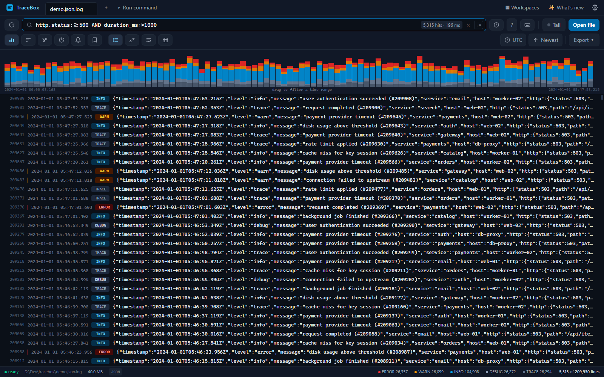
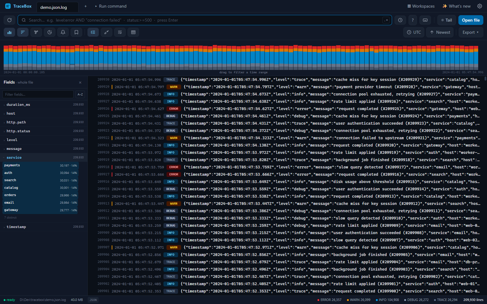
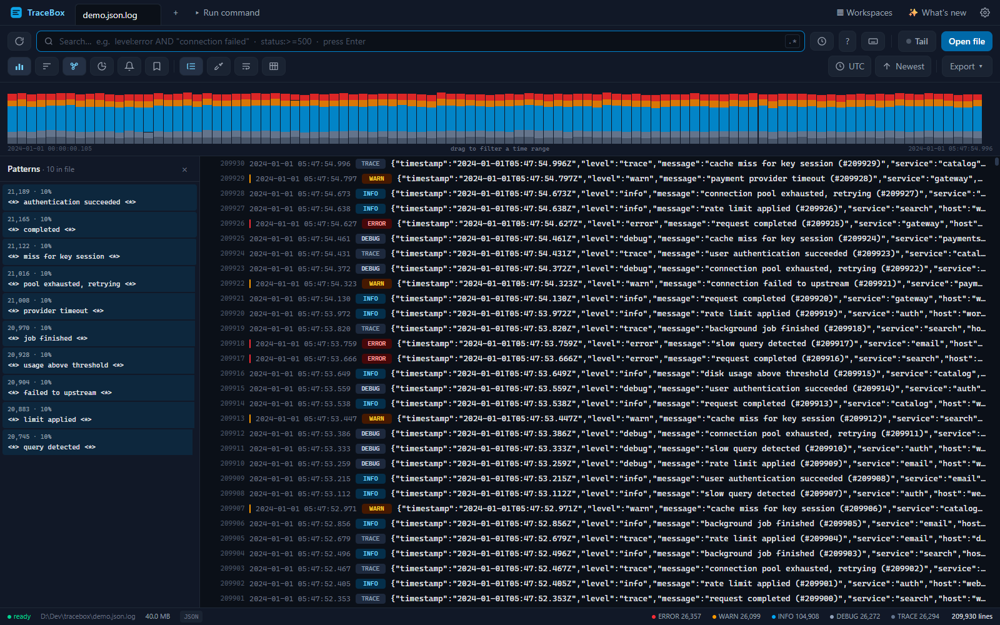
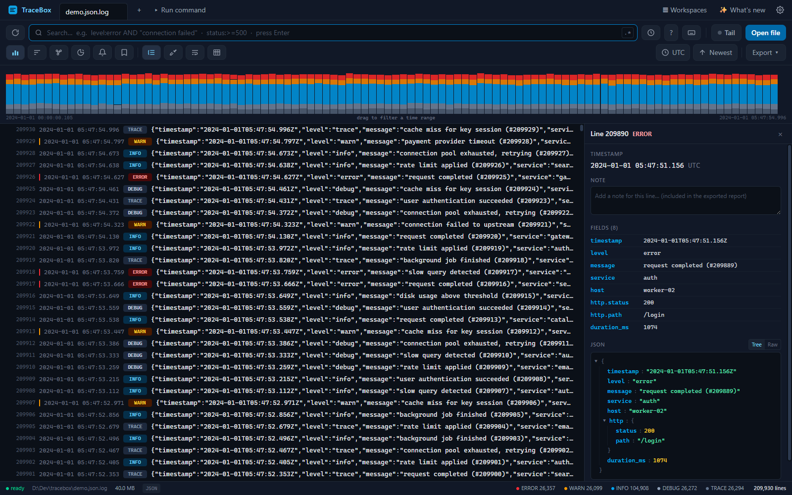

# TraceBox

**A fast, fully offline log reader for multi-gigabyte files** — index a huge log in
seconds, then search, filter, and analyze it like a database. A real full-text search
engine, structured field analysis, live tail, and time histograms, in a desktop app (or a local web app) that keeps everything on your machine.



## Why TraceBox?

Opening a multi-gigabyte log in a text editor grinds to a halt, and `grep` only gets you
single lines with no structure, no timeline, and no way to drill in. TraceBox is built for
exactly these files:

- **It doesn't choke on size.** A 1 GB / 10M-line file indexes in about two minutes and
  stays under ~200 MB of RAM — and it's searchable *while* it indexes.
- **It actually understands your logs.** JSON, timestamped app logs, access logs, syslog,
  logfmt, and more are auto-detected; fields become searchable columns you can filter,
  break down, and chart.
- **It's a real search engine, not a string match.** A Kibana-style query language —
  boolean logic, phrases, field comparisons, wildcards, time ranges — answers in
  milliseconds over millions of lines.
- **It's completely private.** The server binds to `127.0.0.1` only and has zero runtime
  dependencies. Nothing ever leaves your machine, online or off.

## Features

**Built for huge files**
- Sparse line-offset index (one checkpoint per 64 lines) — any of millions of lines is one
  seek away; reads are independent of file size.
- Full-text search via built-in SQLite **FTS5** — no native modules, no services to run.
- Results are materialized, so paging a million rows deep into a result set is instant.

**Powerful search**
- Kibana-style query language: `AND`/`OR`/`NOT`, parentheses, `"exact phrases"`, field
  filters (`level:error`), numeric comparisons (`status:>=500`), time ranges
  (`timestamp:>2024-01-31`), wildcards (`path:/api/*`), and field-exists (`user:*`).
- Match highlighting, "find next", and regex search when you need it.



**Structured analysis**
- Automatic format detection and field extraction (nested JSON flattens to `dot.paths`).
- **Field breakdown** — top values for any field with counts and one-click filtering.
- **Log patterns (clustering)** — collapses near-identical lines into templates so you can
  see "what kinds of lines are in here" at a glance.
- **Time histogram** — stacked per-level volume over time; drag to filter to a range.
- **Summary stats** and a per-level breakdown with one-click filters.
- **User-defined parsers** — teach TraceBox a proprietary format with a regex (named groups
  become fields), with a live tester.
- **Ad-hoc capture fields** — pull a value out of raw lines with a one-off regex
  (`(?<dur>\d+)ms`) straight from the column picker, then filter (`dur:>500`), column,
  and break it down on it — no re-indexing or saved parser needed.

**Field breakdown**



**Log pattern clustering**



**Inspect any line**
- A detail panel shows a line's parsed fields (with one-click "add as filter") and the full
  multi-line record (stack traces fold into one entry).
- Bookmark and annotate lines, then export a Markdown/HTML report for an incident ticket.
- **Redaction** — one toggle masks emails, IPs, tokens, secrets, and card numbers across the
  view, reports, and exports (search still runs on the real data); built-in categories are
  toggleable and you can add your own regex patterns.



**Live monitoring**
- **Live tail (`tail -f`)** — appended lines index incrementally and the active search keeps
  matching them; order oldest- or newest-first.
- **Watch rules** — get alerted when new lines match a query, or when matches cross a rate
  threshold (e.g. "20 errors in 60s"), as in-app toasts and native OS notifications.

**Works with your logs as they are**
- `.gz` files open transparently; a rotation group (`app.log` + `app.log.1` +
  `app.log.2.gz`) opens as one time-ordered stream — and **tail follows the live
  member across rotations**, picking up appends to `app.log` and continuing
  seamlessly when it rolls.
- Multiple files in tabs, plus a **merged timeline** that interleaves several files by time.
- Read from a live command (`docker logs`, `journalctl`, …) as a streaming source.
- Persistent index cache — reopening an unchanged file is instant.
- Export filtered rows to CSV / JSON.

**AI-ready**
- An opt-in [MCP](https://modelcontextprotocol.io) server lets AI agents (Claude, IDE
  agents) investigate your logs through the same engine — see [AI agents](#ai-agents-mcp).

## Get started

### Desktop app (Windows, Linux)

TraceBox ships as a standalone desktop application (built with Electron) — the same engine
and UI in a native window, no browser or localhost URL to manage. Grab an installer from the
[releases page](../../releases), or build it yourself:

```powershell
git clone <this-repo> && cd tracebox
npm install
npm run app      # build everything and launch the desktop app
```

The installer adds a Start-menu entry and an **"Open with TraceBox"** right-click action for
log files, supports double-click / drag-and-drop to open, reuses one window across files, and
**updates itself** (it checks GitHub releases and installs new versions on a click). Requires
[Node.js 24+](https://nodejs.org) to build from source.

### Local web app

TraceBox also runs as a plain local web server (handy for headless or remote machines):

```powershell
cd tracebox
npm install
npm run build     # build the web UI (once, and after UI changes)
npm start         # serve on http://127.0.0.1:7077 and open the browser
```

```powershell
npm start -- --port 8080          # different port
npm start -- C:\logs\app.log      # open a file immediately
npm start -- --no-open            # don't launch the browser
```

No log handy? Generate one: `node scripts/genlog.mjs big.log 1gb app` (formats: `app`,
`json`, `access`). For a *live*, growing log to try the tail with, run
`node scripts/genlive.mjs` (writes to `./live-logs/` until Ctrl+C). See
[`scripts/README.md`](scripts/README.md) for all the generators.

## Query language

| Query | Meaning |
|---|---|
| `error timeout` | lines containing both terms (implicit AND, prefix match) |
| `"connection failed"` | exact phrase |
| `level:error` | field equality (case-insensitive; `warning` ⇒ `WARN`) |
| `status:>=500` | numeric comparison (`>` `>=` `<` `<=` on any extracted field) |
| `timestamp:>2024-01-31` | time comparison (`timestamp:2024-01-31` = that whole day) |
| `path:/api/*` | wildcard match |
| `msg:~time.*out` | regular-expression match on a field (`~`); quote it — `msg:~"(get\|put) /api"` — to include spaces, parentheses, or quotes |
| `/timeout\d+/` | regular-expression match on the whole line; composes with the rest of the query (`level:error AND /timeout\d+/`), and the other filters narrow the lines it scans |
| `user:*` | field exists |
| `NOT database`, `-database` | exclusion |
| `(level:error OR level:warn) AND service:payments` | grouping and boolean logic |
| `http.status:503` | nested JSON fields, searchable via their flattened path |

Timestamps without an explicit timezone are interpreted as UTC, in both log lines and queries.

## AI agents (MCP)

TraceBox ships a [Model Context Protocol](https://modelcontextprotocol.io) server so AI tools
can investigate your logs through the same index and query engine the UI uses — searching and
paging over a multi-gigabyte file instead of streaming it into a context window, then
delivering a report whose quoted log lines are pulled verbatim from the index.

It is **opt-in and off by default**: enable it in **Settings → MCP server**, which then shows
the exact command to register with your MCP client. It's a stdio server with no SDK and no
runtime dependencies, and opens no network sockets of its own — the offline guarantee holds.

The agent can open logs, search, project fields, aggregate (stats, histograms, clusters, field
facets), define custom parsers, and build reports. Tool-by-tool reference and the recommended
agent workflow live in [`CLAUDE.md`](CLAUDE.md).

## Under the hood

| Layer | Choice |
|---|---|
| Runtime | Node.js ≥ 24 (TypeScript run natively via type stripping) |
| Indexing | `node:sqlite` (built-in SQLite with FTS5) — no native modules, no dependencies |
| Backend | Zero-dependency HTTP server, Server-Sent Events for progress/tail |
| Frontend | React 19 + TypeScript + Vite 7 + Tailwind CSS 4 |
| Virtualization | `@tanstack/react-virtual` (smooth scrolling over millions of rows) |
| Desktop | Electron shell (`server/` and `web/` stay platform-agnostic) |

**How the big-file path works:** the file is streamed in 4 MB chunks; each line gets a
byte-offset index entry and is parsed into SQLite (FTS5 + a key/value fields table) in
20k-line transactions, with progress streamed over SSE — it's browsable while indexing. A
query compiles to a single SQL expression and materializes its results, so paging anywhere is
O(1). Reads seek to the nearest 64-line checkpoint and scan forward. Tailing indexes appended
bytes incrementally and extends the active search over new lines only.

**Performance** (measured on a 1 GB / 9.8M-line app log):

| Operation | Result |
|---|---|
| Index the full file | ~2 minutes, searchable throughout |
| Reopen the same file | instant (index reused) |
| `level:error` (1.2M hits) | 230 ms |
| Needle-in-haystack term | 3 ms |
| Paging 1M rows deep | < 150 ms |
| Server RSS with the file fully indexed | ~170 MB |

## Project layout

```
tracebox/
├─ server/     zero-dependency Node.js backend: indexing, parsers, query engine, sessions, HTTP/SSE
├─ web/        React UI (Vite + Tailwind)
├─ electron/   desktop shell (spawns the backend, native window, file associations)
└─ scripts/    dev runner, esbuild bundler, synthetic log generator
```

Contributing or working in the code? See [`CLAUDE.md`](CLAUDE.md) for conventions,
commands, and how the pieces fit together.

## License

No license file is currently included; all rights reserved by the author.
